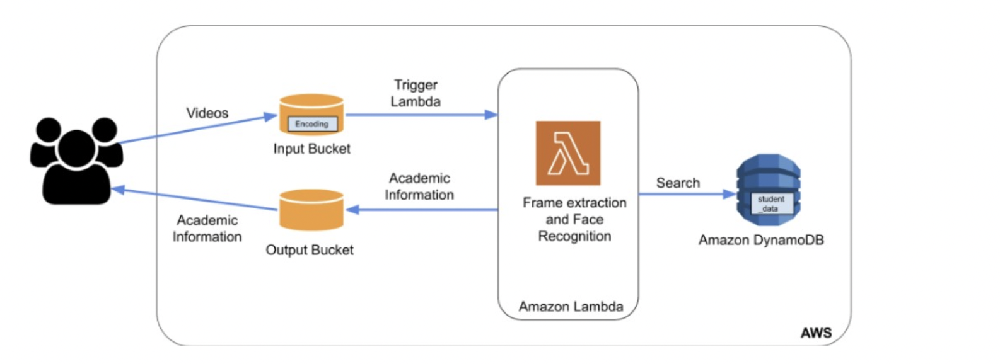

# lambda-autoscaling

## 1. Problem Statement
The aim of this project is to use PaaS cloud service to create an application that automatically scales out and scales in based on the demand. The application receives videos and classifies them using face recognition and then based on the identified person, relevant information about the person should be returned. The application should service a high number of requests very efficiently and concurrently.

## 2. Autoscaling
Each Lambda function is executed by AWS Lambda as a separate process in its own environment. A default cap of 1000 concurrent Lambda functions applies. The environment is built, the function is executed, and the environment is destroyed each time an event source executes a Lambda function. 1000 Lambda functions are launched when there are 1000 invocations. It automatically scales by operating concurrently on the AWS infrastructure. AWS's responsibility is to make sure that their back-end infrastructure can scale to accommodate the total amount of Lambda functions being executed by all of their clients.

## 3. AWS Services used in the project 

1. AWS Lambda:
Using AWS Lambda we can run any application/backend service/ code without having the need to provision or manage servers thus providing a serverless service. It is event driven which means that the code will be executed based on the specified event, which in our case is whenever an object is pushed into the input bucket. The AWS Lambda function runs the entire code on being triggered and returns the corresponding academic information to the output bucket.
2. AWS S3:
AWS S3 provides persistent and durable storage services. We are using two S3 buckets, one to store the incoming videos(.mp4) uploaded by the workload generator. The AWS Lambda stores the recognized student’s academic information(.csv format) in the other S3 bucket
3. AWS ECR:
AWS Elastic Container Registry is a fully managed container orchestration service that makes it easy for the users to deploy, manage and scale the containerized applications. We stored our Docker image in the Registry and Lambda service was created using this image.
4. Amazon DynamoDB:
Amazon DynamoDB is a fully managed, serverless, NoSQL database. It runs high-performance applications which can be scaled easily.  DynamoDB is used to store academic information of the person in a key-value format.
5. Amazon Cloudwatch:
Amazon Cloudwatch helps to monitor the logs generated by different AWS services. We utilized this service to monitor the Lambda function to print out logs and to test output of different variables in the code.

## 4. Architecture

 

## 5. Commands to run the project:-
1. Install Python.
2. Locally install boto3 and awscli dependencies
3. Configure the AWS environment by following AWS documentation (use command aws configure in the AWS cli)
4. Create ECR in us-east-1 region, create input and output S3 buckets
5. Install docker following the guide given on the AWS ECR console
6. Push the docker image into the ECR following the steps provided on the AWS ECR console
7. Create a lambda function using this docker image. **Important-** For M1/M2 mac use the arm64 architecture, for others use the default x86 architecture.
8. Add a trigger for the lambda funtion of type Object Creation Event on S3 input bucket.
9. Execute the workload file to upload videos to the input bucket which inturn triggers the lambda function
10. Browse the output bucket to find the respective academic records being produced as csv files
